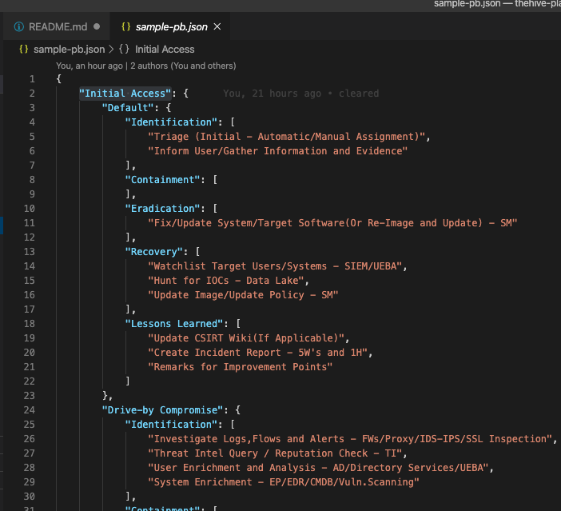
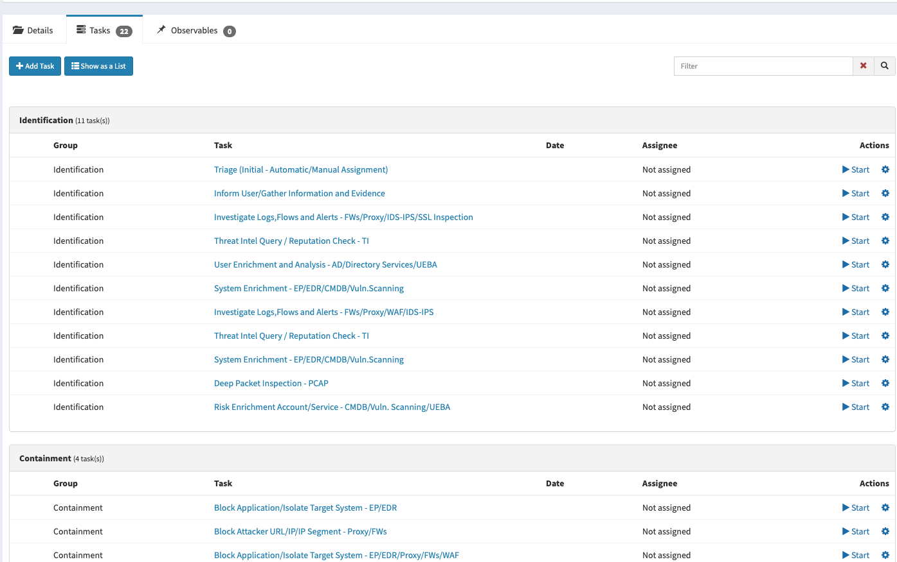

# thehive-playbook-creator
A script to create and assign SOP tasks dynamically to the cases.

# WHY
TheHive has built-in case templates functionality, which you can use with predefined case bindings. But I found it a bit tricky/hard to manage when working with multiple incident sources with endless mapping options. Therefore I made this simple playbook creation script.
Using this approach, you can build methods that you can dynamically create and assign playbooks using types of alarms or correlation rule groups you have, from any case post method. (Siem, workflow engine, email parser, etc.)
Actually, my use-case was for using IBM QRadar Rule Groups to build custom/dynamic playbooks. Getting the rule groups of the rules that are contributing to an offense, then using them to create your tailored incident response playbook/response tasks...

To make it clearer, I prepared a sample playbook with potential incident response actions to the first Mitre Tactic("Initial Access") and all techniques under that. Use this sample script to build your integration method for your alerts/incidents; add your flavor of incident response procedures into the Json file in order; or add the remaining items for Mitre tactics & techniques etc. and there you have a dynamic SOP library!

# NOTES
I used a json file to define and sort all playbook items/tasks in order.
The top leading group is for default tasks; see first "Default" tasks group followed by more particular groups of incident response tasks for more certain rule/alarm types. This usage gives you the possibility to map an incident into a default catch group first. And if you have more rules(alerts) contributing to that case (2 or more supported), which makes it more precise, you can also specify more detailed incident response steps for them.

You will see the entries on theHive at the order that you wrote them into the json file. So keep the file in the order you like.
And another benefit might be for devops approach; using this json based playbook with Git and dev pipelines, you can monitor and manage changes with your code branches and also apply for approvals before any push to your main branch - which is your SOP/Playbook.

> This script uses thehive4py from the official project repo; please obtain the most up2date version there:
> -[https://github.com/TheHive-Project/TheHive4py.git]

# Json file

# TheHive

